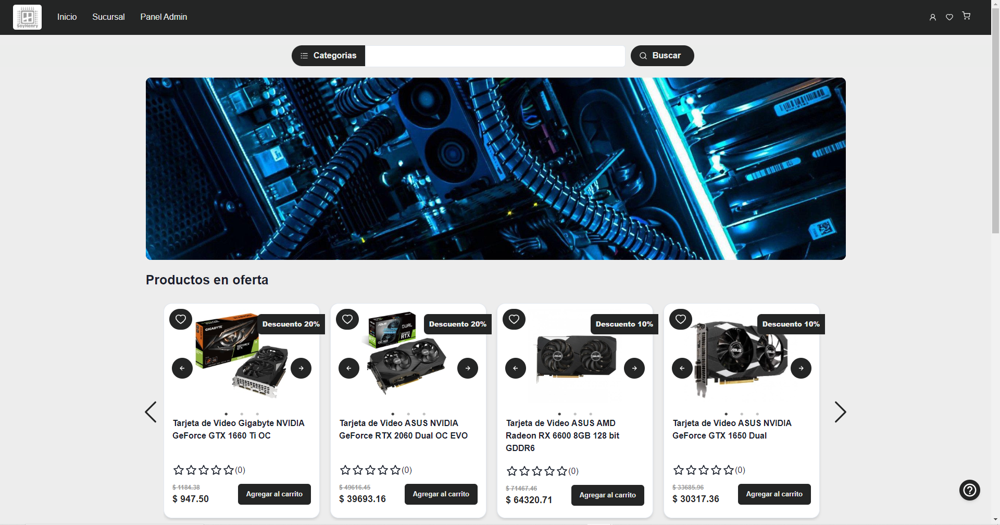

### Hola👋 
### Soy Agustin Marcos!

Bienvenidos a mi página de Github! Soy Agustin y actualmente me encuentro en la búsqueda de mis primeras expriencias en el mundo del desarrollo web!  

#### 🌱 Metas personales: 

- Hacer ejercicio 5 días a la semana :muscle:
- Asistir al Gimnasio 4 dias a la semana :punch:
- Levantarse más temprano para aprovechar bien el día :clock6:
- Estudiar al menos 3 libros al mes :books:
- Mejorar mi CV con algo de educación (no solo en programación) :page_facing_up:

#### :muscle: Metas profesionales:
- Tomar cursos en línea sobre Data Science e idioma (Inglés)🚀
- Codificación al menos 4 horas al día :computer:
- Ampliar mi stack personal de tecnologías :zap:

  

#### :computer: Lenguajes y herramientas de programación: 

<h3 align="left">Lenguajes de programacion:</h3>

 

<h3 align="left">En frontEnd:</h3>

 
 
 
<a href="https://redux.js.org" target="_blank">  
<a href="https://chakra-ui.com/">

<h3 align="left">En BackEnd</h3>

 
 
 

 

  

<h1 align="center" >Proyectos</h1>

  
 
  <h3 align="left">📊GitHub Stats:</h3>

 

&nbsp;

 
 

 
 

 
  

